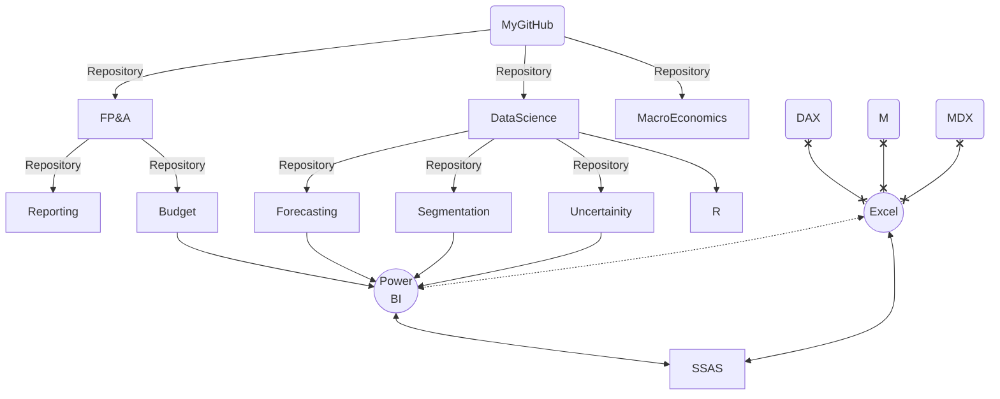

### Hi there 👋
- [x] I use **M** for data transformation (_ETL_), **DAX** and **R** for data visualisation and analysis, and **SQL** for data query

- [ ] check out all my repositories :point_down: 
