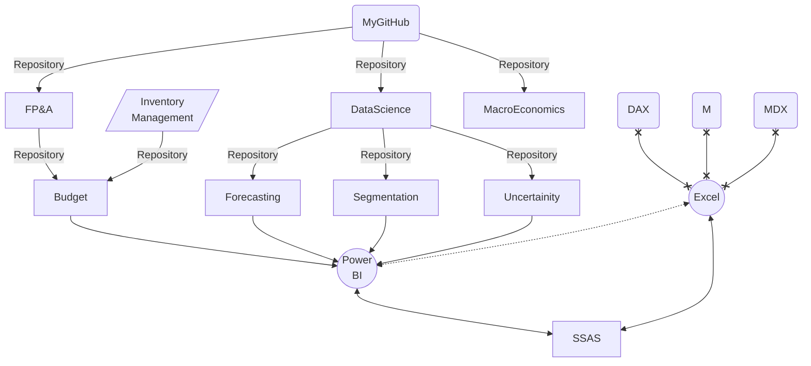

### Hi there 👋
- I use **M** for data transformation (_ETL_), **DAX** and **R** for data visualisation and analysis, and **SQL** for data query
- Have a look at my short presentation about my prefered solutions in BI 👉 [:computer:](https://md3629.github.io/)
- check out my repositories :point_down: and :black_nib: if you need any help

### Sample work in Excel, Power BI or R
- [x] Budgeting (bottom up): https://github.com/md3629/FPA/blob/main/Budget/data/Model.xlsx
- [x] Forecasting: https://github.com/md3629/FPA/blob/main/Budget/data/Budget%20-%20Top%20Down.pbix
