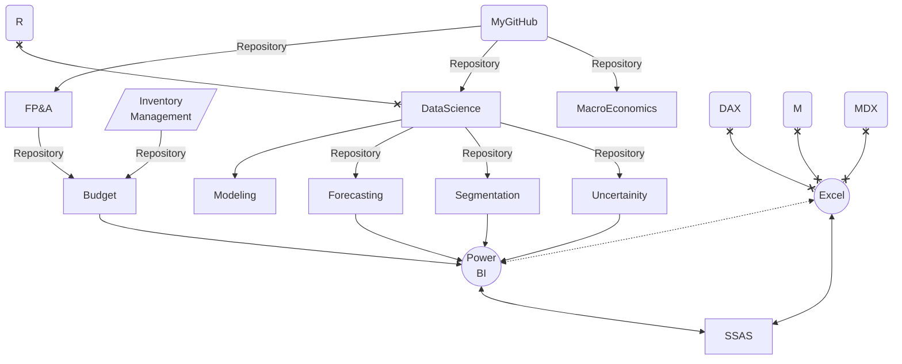

### Hi there 👋

- 🔭 I’m currently working on Forecasting using **R**
- I use **M** for data transformation (_ETL_), **DAX** and **R** for data visualisation and analysis, and **SQL** for data query
- Have a look at my short presentation about my prefered solutions in BI 👉 [:computer:](https://md3629.github.io/)
- check out my repositories :point_down: and :black_nib: if you need any help

